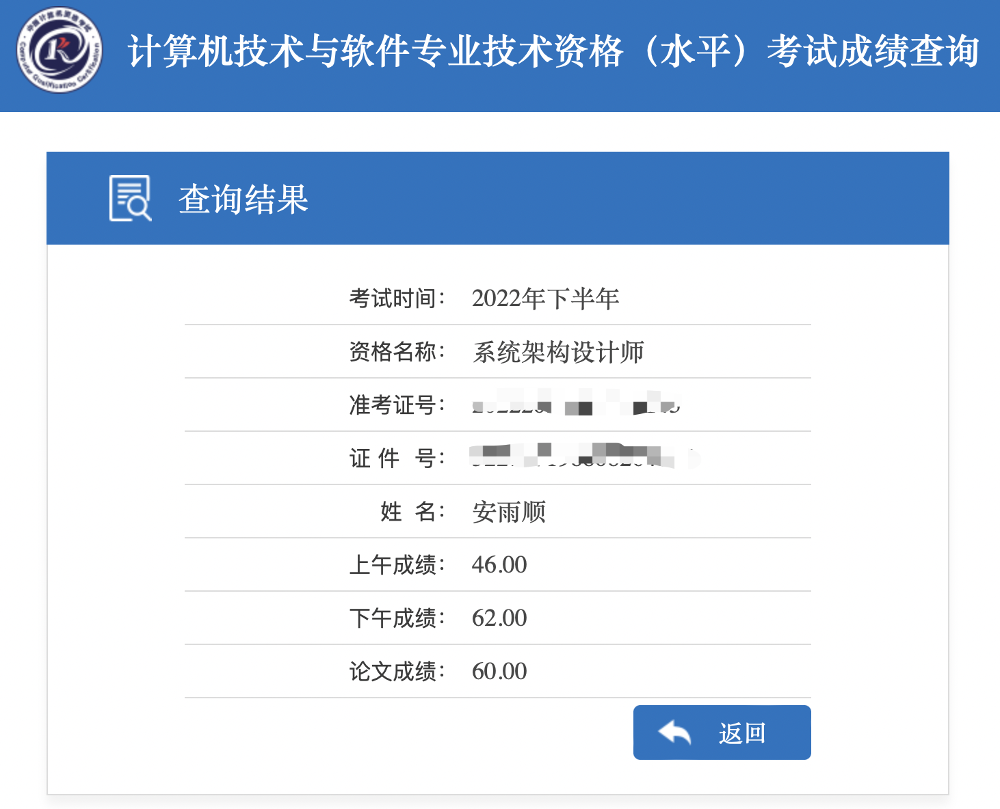

# 成为系统架构设计师
## 大事记
- 2022年5月5日，创建了本项目，决定记录
- 2022年11月5日，计算机技术与软件专业技术资格（水平）考试
- 2022年12月15日，计算机技术与软件专业技术资格（水平）考试开放成绩查询
- 2023年1月31日，重新打开本项目，把之前的梦继续做下去

## 来龙去脉
2022年5月5日，我异常激动，因为那时的我认为6个月后我将是名副其实的系统架构设计师，我会搭上“计算机技术与软件专业技术资格（水平）考试”的快车，去欣赏从程序员转型系统架构设计师一次又一次蜕变，去享受成为系统架构设计师后的荣耀

为此，我制作了一份非常不错的[备考计划](./README-old.md)，现在看来依然热血沸腾，好喜欢那个自己

然而，世事难料，2022年，工作上是忙碌的一年，项目一个接着一个，虽然如此，还是利用早上上班前和晚上下班后的时间做了一些准备，整体完成度40%左右

2022年10月11日，离计算机技术与软件专业技术资格（水平）考试还有25天，我屈服了，成为了当初不屑成为的人，我报名了某培训机构的精品课程，开启了疯狂的备考冲刺

2022年10月，是广州的艰难时刻，疫情肆虐，威胁着每一个人，海珠大面积封控，其他区也是零星封控；也是我的艰难时刻，临近考试，为小孩儿感冒发烧操心、熬夜，加上模拟考试，基本每天三到四个小时睡觉时间。双重艰难，广州市政府和我都挺住了，最终顺利参加了考试

2022年12月15日，培训群里热热闹闹，有人晒出了成绩单，打开成绩查询页面输入相关信息后我看到了

此处，应该有掌声^_^，我激动的心怦怦乱跳，就算跳的再乱，也还惦记着发个朋友圈让大伙儿一起开心开心；挥舞着一双颤抖的手，抖得再厉害，也能把马赛克和爽文写利索咯

## 路在何方
看到这里，可能有人会问，都考过了，还来干嘛？

因为：热情还在，梦想依旧，我要成为名副其实的系统架构设计师！！！

## 目录
- 第一章 关于计算机技术与软件专业技术资格（水平）考试和系统架构设计师
  - 第一节 [什么是计算机技术与软件专业技术资格（水平）考试](第一章/什么是计算机技术与软件专业技术资格（水平）考试.md)
  - 第二节 [什么是系统架构设计师](./第一章/什么是系统架构设计师.md)
  - 第三节 [我需要报班吗](./第一章/我需要报班吗.md)
  - 第四节 [系统架构设计师教程涵盖的知识面](./第一章/系统架构设计师教程涵盖的知识面.md)